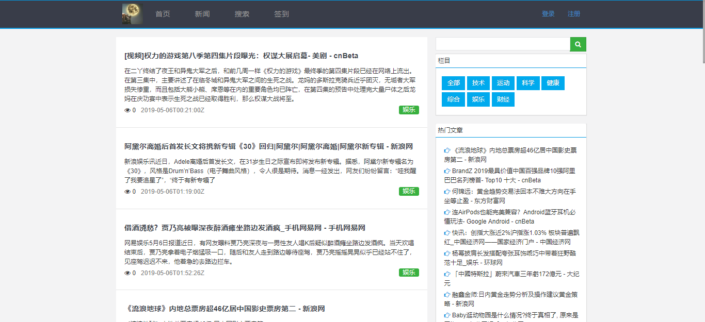
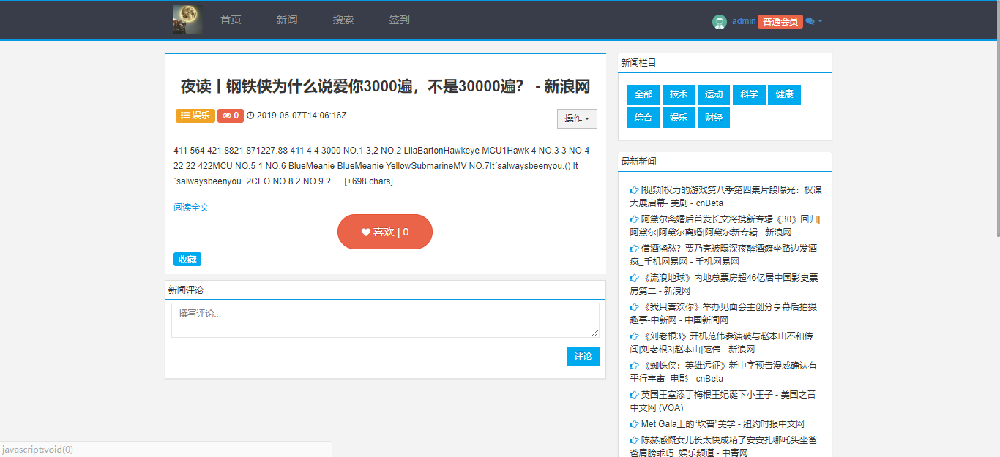
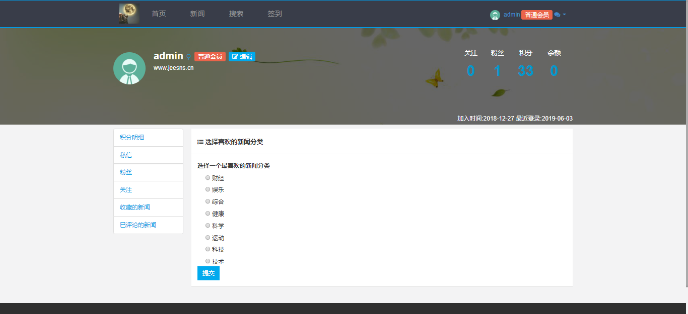
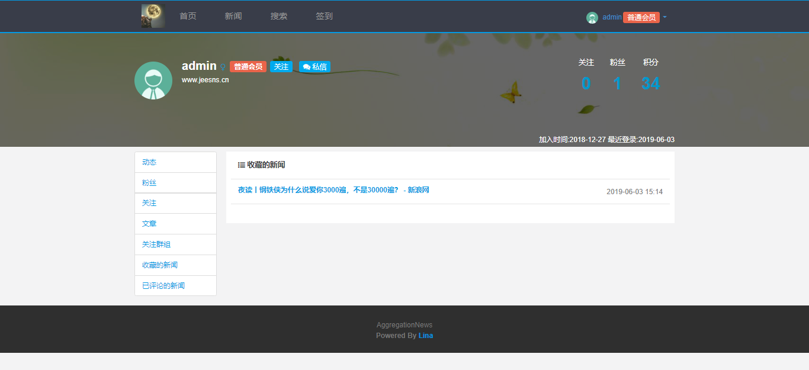
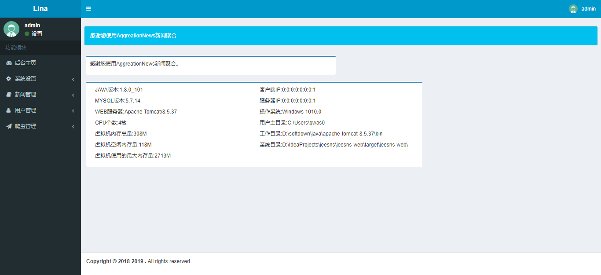
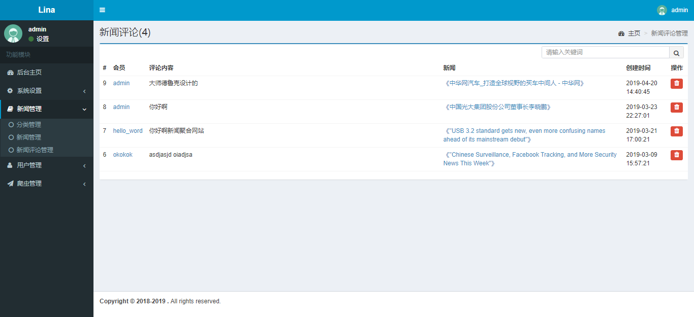
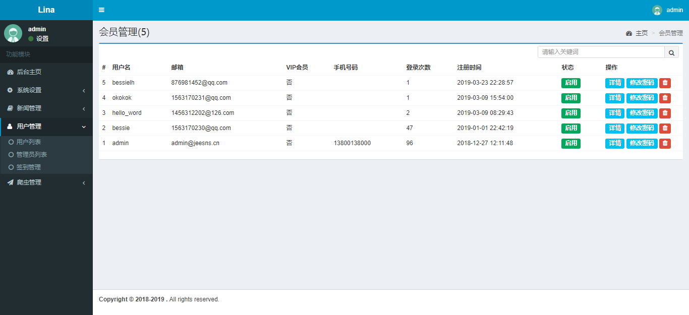

## AggregationNEW

本网站是一个基于分布式爬虫的新闻聚合网站，网站是实现基于传统JavaEE。分布式数据实现基于爬虫。感谢:  NEWSAPI [https://newsapi.org]
分布式爬虫后台基于Pyspider框架。

###### 项目展示
打开新闻页面

新闻详情展示

新闻检索

个人展示详情

新闻收藏

系统管理

新闻评论审核

用户管理

爬虫管理

###### 开发配置：

后台：**Springmvc，Spring,mybatis框架实现**
前端显示：**zui+boostrap+jquery**
前端模板：**freekmark**

jdk:1.8.0
maven:3.6.0
Tomcat:8.5.37
python:3.6.0

其他的就看pom配置吧

爬虫部分可以移步：https://github.com/x-bessie/pyspider_news
